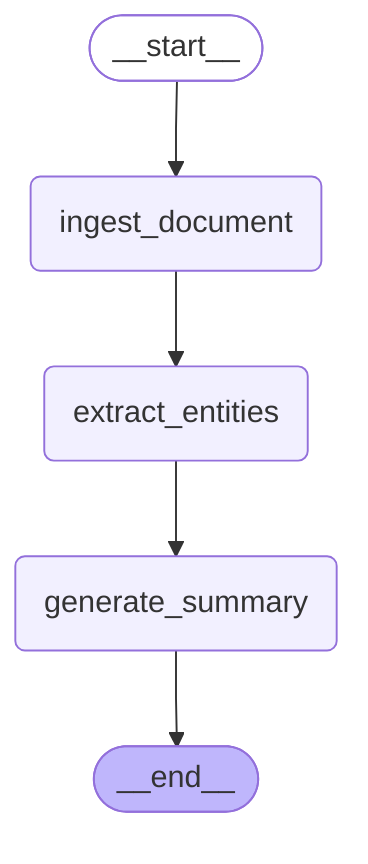

# Complaint Copilot AI — LangGraph Pipeline Diagram

> Auto-generated from `graph.py`. Use this in the demo video to show the real multi-node LangGraph agent structure.

## Step 2: Active Nodes (3-node pipeline)



## Full Pipeline (Steps 2–4)

```
ingest_document
  -> extract_entities        [llama-3.1-8b-instant]
    -> validate_completeness  [llama-3.1-8b-instant]
      -> classify_severity_risk [llama-3.3-70b-versatile]
        -> detect_duplicate    [llama-3.1-8b-instant]
          -> recommend_capa    [llama-3.3-70b-versatile]
            -> generate_summary [llama-3.1-8b-instant]
              -> END
```
