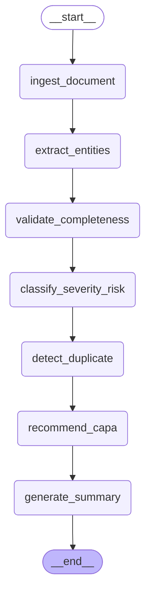

# Complaint Copilot AI — LangGraph Pipeline Diagram

> Auto-generated from `graph.py`.

## Active Pipeline (7 Nodes)



## Node Model Assignments

```
ingest_document
  -> extract_entities        [llama-3.1-8b-instant]
    -> validate_completeness  [llama-3.1-8b-instant]
      -> classify_severity_risk [llama-3.3-70b-versatile]
        -> detect_duplicate    [rule-based SQL]
          -> recommend_capa    [llama-3.3-70b-versatile]
            -> generate_summary [llama-3.1-8b-instant]
              -> END
```
